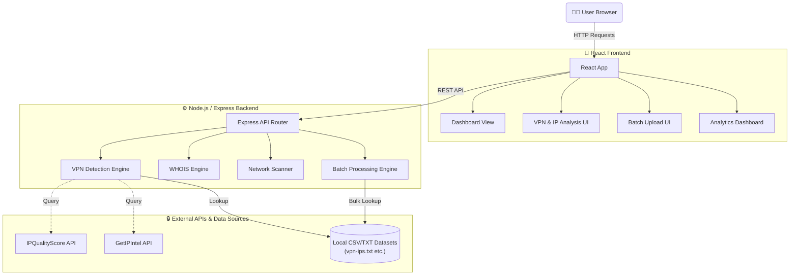

# VPN Detection System - MERN Stack Project

A comprehensive MERN stack application for VPN and proxy detection using pure JavaScript technologies.

## 🏗️ Project Structure

```
Final_Yr_Project/
├── backend/                 # Node.js Express API
│   ├── routes/             # API endpoints
│   ├── utilities/          # Helper functions
│   ├── server.js           # Main server file
│   └── package.json        # Backend dependencies
├── frontend/               # React.js UI (JavaScript)
│   ├── src/
│   │   ├── components/     # React components
│   │   ├── services/       # API integration
│   │   └── App.js         # Main app
│   └── package.json       # Frontend dependencies
└── README.md              # This file
```

## 📊 System Architecture



## 🚀 Quick Start

### Backend Setup
```bash
cd backend
npm install
npm start
```

### Frontend Setup (React.js)
```bash
cd frontend
npm install
npm start
```

### Access Points
- **Frontend**: http://localhost:3000
- **Backend API**: http://localhost:5000
- **API Documentation**: http://localhost:5000/api

## 🔧 Backend Features

### API Endpoints
- **WHOIS Lookup**: `/api/whois/getrecord`
- **VPN Detection**: `/api/vpndetect/*`
- **Batch Processing**: `/api/batchprocess/processfile`
- **Analytics**: `/api/analytics/getallanalytics`
- **Network Scanning**: `/api/advancedsearch/*`

### Security Features
- Input validation and sanitization
- XSS protection
- Timeout handling
- Error boundary management
- CORS configuration

## 🎨 Frontend Features

### Components
- **Dashboard**: System overview and analytics
- **WHOIS Lookup**: Domain/IP information retrieval
- **VPN Detection**: Multi-method detection interface
- **Batch Processing**: File upload for bulk analysis
- **Network Scanning**: Port scanning interface
- **Analytics**: Detailed reporting dashboard

### UI/UX Features
- Responsive design (mobile-first)
- Modern Tailwind CSS styling
- Loading states and error handling
- Toast notifications
- Interactive forms and data display

## 🔒 Security Implementation

### Backend Security
- Input sanitization for suspicious patterns
- Host format validation
- DNS timeout handling
- API rate limiting (configurable)
- Error logging and monitoring

### Frontend Security
- XSS protection in forms
- Input validation
- Secure API communication
- Error boundary handling
- CSRF protection

## 🧪 Testing

### Backend Testing
```bash
cd backend
npm test
```

### Frontend Testing
```bash
cd frontend
npm test
```

### Manual Testing
- Postman collection included
- Test scripts for API endpoints
- Comprehensive error handling tests

## 📈 Performance

### Backend Optimization
- Async/await for non-blocking operations
- Promise-based timeout handling
- Memory management for large datasets
- Efficient data processing

### Frontend Optimization
- Code splitting
- Lazy loading
- Memoization
- Optimized bundle size

## 🔧 Configuration

### Environment Variables
```env
# Backend
PORT=5000
IP_QUALITY_SCORE_API_KEY=your_key
GET_IP_INTEL_CONTACT_EMAIL=your_email

# Frontend
REACT_APP_API_URL=http://localhost:5000/api
```

### Dependencies
- **Backend**: Express, Axios, CORS, LibNmap, IP2Proxy
- **Frontend**: React.js, JavaScript, Custom CSS, Axios
- **Database**: File-based storage (no external database required)

## 🚀 Deployment

### 🌐 Frontend Deployment (Vercel)
Vercel is the recommended platform for deploying the React frontend.

1. **Push your code** to a GitHub repository.
2. Create a free account on [Vercel](https://vercel.com/) and link it to your GitHub.
3. In Vercel, click "Add New..." -> "Project" and import your repository.
4. In the "Configure Project" section:
   - **Framework Preset**: Create React App (or Vercel will auto-detect it)
   - **Root Directory**: Select the `frontend` folder.
   - **Environment Variables**: Add `REACT_APP_API_URL` and set its value to your deployed backend URL.
5. Click **Deploy**. Your frontend will be live in minutes.

### ☁️ Backend Deployment (Render)
Render is an excellent free-tier service for hosting the Node.js/Express backend.

1. Create a free account on [Render](https://render.com/) and link your GitHub.
2. From the Render Dashboard, click "New" -> "Web Service".
3. Connect your GitHub repository.
4. Fill in the deployment details:
   - **Root Directory**: `backend`
   - **Environment**: Node
   - **Build Command**: `npm install`
   - **Start Command**: `npm start` (or `node server.js`)
5. Under **Environment Variables**, add all keys from your `.env` file:
   - `IP_QUALITY_SCORE_API_KEY`
   - `GET_IP_INTEL_CONTACT_EMAIL`
6. Click **Create Web Service**. Once deployed, copy the Render URL and update your Vercel `REACT_APP_API_URL` variable.

### Production Considerations
- **CORS Configuration**: Ensure your `backend/server.js` explicitly allows requests from your new Vercel frontend URL in its CORS settings.
- **Environment Variables**: Never commit API keys to version control; always add them directly in Vercel and Render dashboards.
- **File Storage**: If using the free tier on Render, local files (like batch processing uploads) are wiped on restarts. Consider cloud storage integrations for persistence.

## 📝 API Documentation

### WHOIS Endpoint
```javascript
POST /api/whois/getrecord
{
  "host": "google.com"
}
```

### VPN Detection
```javascript
POST /api/vpndetect/qualityscore
{
  "host": "8.8.8.8"
}
```

### Batch Processing
```javascript
POST /api/batchprocess/processfile
FormData with 'ipFile'
```

## 🐛 Troubleshooting

### Common Issues
1. **CORS Errors**: Check backend CORS configuration
2. **API Timeouts**: Verify timeout settings
3. **Build Errors**: Clear node_modules and reinstall

### Debug Mode
- Backend: Set `DEBUG=true` in environment
- Frontend: Use React DevTools
- API: Check browser network tab

## 📊 Analytics

### System Metrics
- Total data points processed
- Training vs test data split
- API response times
- Error rates

### Logging
- Data generation logs
- API request/response logs
- Error tracking

## 🔮 Future Enhancements

### Planned Features
- Real-time monitoring dashboard
- Advanced ML models
- Database integration
- User authentication
- API rate limiting
- Comprehensive testing suite

### Scalability
- Microservices architecture
- Load balancing
- Database clustering
- Caching layer
- CDN integration

## 📞 Support

For technical support and questions:
1. Check the troubleshooting section
2. Review API documentation
3. Check error logs
4. Verify configuration

## 📄 License

This project is developed for educational purposes as part of a final year project.

---

**Status**: ✅ Pure MERN Stack Complete | ✅ Cybersecurity | ✅ All Features Working
